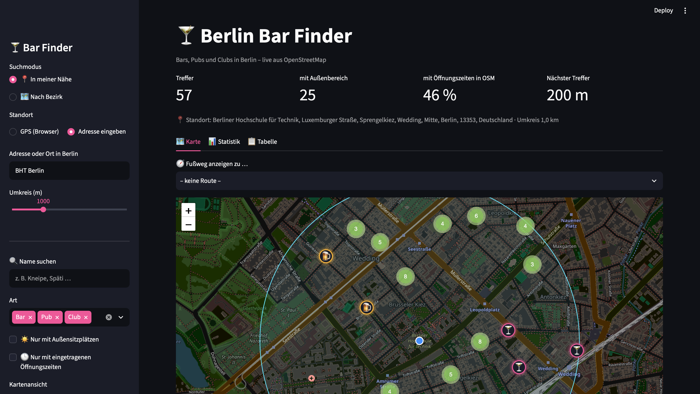
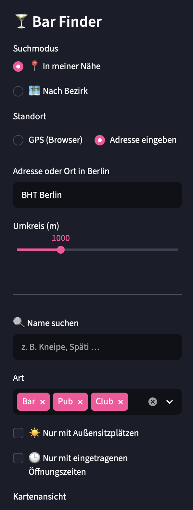

# Berlin Bar Finder

**GeoIT-Projekt im Modul GIS-Geländepraktikum – BHT Berlin, Bachelor Geoinformation**

| | |
|---|---|
| **Name** | T. Wittig |
| **Matrikelnummer** | 110407 |
| **Live-App** | LINK-ZUR-STREAMLIT-APP |
| **Quellcode** | LINK-ZU-DIESEM-REPO |

---

## Kurzbeschreibung

Der Berlin Bar Finder ist eine interaktive Webanwendung, die Bars, Pubs und Clubs in Berlin auf einer Karte darstellt. Die Daten werden **live aus OpenStreetMap** über die Overpass API abgefragt, sodass die App immer den aktuellen Stand der OSM-Datenbank zeigt.

Die Nutzer können nach Bezirk, Art des Lokals, Außensitzplätzen und eingetragenen Öffnungszeiten filtern. Ein Klick auf einen Marker zeigt Name, Adresse, Öffnungszeiten und Website.

### Anbindung an die OSM-Infrastruktur

Die App liest OSM-Daten nicht nur, sondern führt direkt zu ihrer Verbesserung zurück:

- **„In OSM bearbeiten“** öffnet das jeweilige Objekt direkt im OSM-Editor (iD).
- **„Fehler melden“** legt an der Position eine OSM-Note an, auch ohne OSM-Account.
- Die Kennzahl **„mit Öffnungszeiten in OSM“** macht die Datenvollständigkeit sichtbar und zeigt, wo Mapping-Bedarf besteht.

## Funktionen

**Location-Based-Funktionen**
-  **Standortsuche:** eigener Standort per GPS (Browser-Freigabe) oder alternativ über eine eingegebene Adresse (Geocoding mit Nominatim)
-  **Umkreissuche** (250 m – 3 km) mit Sortierung nach Entfernung (Haversine-Formel)
-  **Fußweg-Routing:** Route zu einem gewählten Lokal wird auf der Karte eingezeichnet, mit Strecke und Gehzeit (OSRM-Server der FOSSGIS, Fußgängerprofil)

**Karte und Filter**
- Suche nach allen 12 Berliner Bezirken inkl. eingezeichneter Bezirksgrenze
- Filter nach Art (Bar / Pub / Club), Name, Außensitzplätzen und Öffnungszeiten
- Umschaltbar zwischen Marker-Ansicht (mit Clustering) und **Heatmap** der Lokaldichte
- Dunkles „Nightlife“-Design mit eigenen Symbolen je Typ

**Auswertung**
- Kennzahlen zu Treffern, Außenbereich, Öffnungszeiten und nächstem Lokal
- Statistik-Tab: Verteilung nach Art und **Datenvollständigkeit in OSM** je Merkmal
- Tabellenansicht mit CSV-Export

## Datengrundlage

- **Quelle:** OpenStreetMap, © OpenStreetMap-Mitwirkende, Lizenz ODbL
- **Tags:** `amenity=bar`, `amenity=pub`, `amenity=nightclub` (Nodes, Ways und Relations)
- **Gebiete:** Berliner Bezirke als `boundary=administrative` + `admin_level=9` innerhalb von Berlin (`admin_level=4`)

Beispielabfrage (Overpass QL) für einen Bezirk:

```
[out:json][timeout:90];
area["name"="Berlin"]["boundary"="administrative"]["admin_level"="4"]->.berlin;
rel(area.berlin)["boundary"="administrative"]["admin_level"="9"]["name"="Neukölln"];
map_to_area->.gebiet;
nwr["amenity"~"^(bar|pub|nightclub)$"](area.gebiet);
out center tags;
```

## Technik

| Komponente | Zweck |
|---|---|
| Python | Programmiersprache |
| Streamlit | Weboberfläche |
| Folium / Leaflet.js | Interaktive Karte |
| Overpass API | Live-Abfrage der OSM-Daten und Bezirksgrenzen |
| Nominatim | Adresssuche (Geocoding) |
| OSRM (routing.openstreetmap.de) | Fußweg-Routing |
| streamlit-js-eval | Standortabfrage im Browser |
| pandas / NumPy | Datenaufbereitung, Filterung, Entfernungsberechnung |

Alle externen Abfragen werden zwischengespeichert, um die Nutzungsbedingungen der öffentlichen OSM-Dienste einzuhalten.

## Projektstruktur

```
berlin-bar-finder/
├── app.py            # Streamlit-Oberfläche (Filter, Karte, Tabelle)
├── overpass.py       # Overpass-Abfragen (Lokale, Bezirksgrenzen)
├── geodienste.py     # Adresssuche, Routing, Entfernungsberechnung
├── requirements.txt  # benötigte Python-Pakete
├── start.command     # Startdatei macOS (Doppelklick)
├── start.bat         # Startdatei Windows (Doppelklick)
├── .streamlit/
│   └── config.toml   # dunkles Farbschema
└── screenshots/      # Screenshots für diese Beschreibung
```

## Lokal ausführen

Voraussetzung: Python 3.9 oder neuer

**Per Doppelklick:** `start.command` (macOS) bzw. `start.bat` (Windows). Beim ersten Start wird die Umgebung automatisch eingerichtet.

**Oder manuell im Terminal:**

```bash
python3 -m venv .venv
source .venv/bin/activate        # Windows: .venv\Scripts\activate
pip install -r requirements.txt
streamlit run app.py
```

Die App öffnet sich anschließend im Browser unter `http://localhost:8501`.

## Screenshots




